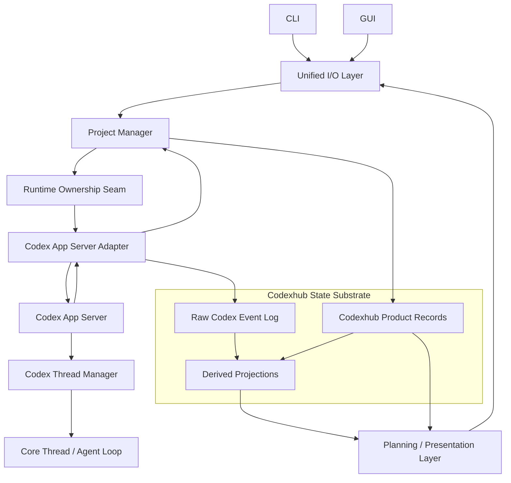

# Architecture Canvas

## System Goal

Codexhub is a local Codex worker control plane. It gives a human operator or
manager agent a durable, low-context surface for starting Codex workers,
observing progress, sending follow-up instructions, grouping runs, and reviewing
outcomes without replaying a whole Codex thread into context.

Codexhub should align with Codex App Server rather than duplicate it. Codex App
Server owns native runtime concepts such as threads, turns, items, and the core
agent loop. Codexhub owns local product records, orchestration meaning, raw event
mirroring, and operator-facing projections.

## Domain Model

- Project: a local planning container for workspaces, worker records, run
  groups, and defaults.
- Workspace: a local checkout, clone, or worktree where a Codex worker acts.
- Worker record: Codexhub's durable identity for a managed unit of work. It is
  the identity used by CLI, GUI, run groups, review findings, and task specs.
- Codex thread / turn / item: Codex-owned foreign state surfaced by Codex App
  Server. Codexhub stores these identifiers and payloads for correlation and
  projection, but they are not Codexhub lifecycle authority.
- Raw Codex event log: append-only, lossless storage of native Codex App Server
  events.
- Codexhub records: projects, workspaces, worker records, messages, task specs,
  run groups, review status, and review findings.
- Derived projections: latest agent message, transcript windows, dashboard
  summaries, attention reasons, and action availability.
- Planning / presentation view: a bounded, operator-facing interpretation of
  records and projections for CLI and GUI.

## System Map

## Key User/Runtime Flows

### Start Worker

1. CLI or GUI sends a start request to the Unified I/O Layer.
2. Unified I/O normalizes the request into a Codexhub command.
3. Project Manager validates project, workspace, task spec, and run group
   context.
4. Project Manager creates the Codexhub worker record and initial message.
5. Runtime Ownership Seam starts or connects to the process that owns Codex App
   Server.
6. Codex App Server Adapter starts the native Codex thread and turn.
7. Adapter records native thread / turn / item events in the raw event log.
8. Project Manager updates Codexhub product records from normalized outcomes.
9. Projections and Planning / Presentation expose bounded progress to CLI and
   GUI.

### Continue Or Steer Worker

1. Unified I/O normalizes the operator action.
2. Project Manager checks Codexhub state-machine rules and worker record state.
3. Runtime Ownership Seam proves the underlying Codex runtime is available.
4. Codex App Server Adapter sends the native protocol request.
5. Native events return through the Adapter and are appended to the raw event
   log before projections are derived.

### Inspect Progress

1. CLI or GUI asks for a session, transcript, run group dashboard, or review
   view.
2. Planning / Presentation reads Codexhub records and derived projections.
3. The response is bounded, human-readable, and low-context by default.
4. Raw events remain available as an explicit debug surface.

## Modules And Interfaces

### Unified I/O Layer

- Responsibility: normalize external commands and adapt output for CLI and GUI.
- Interface: command inputs from CLI/GUI and view/result outputs from Planning /
  Presentation.
- Dependencies: Project Manager and Planning / Presentation.
- Test surface: stable command DTOs, JSON output, GUI action availability, and
  error shapes.
- Design judgment: should be deep enough to remove duplicate input filtering and
  output adaptation. A separate input-filter module would fail the deletion
  test because its complexity would move back into I/O callers.

### Project Manager

- Responsibility: own Codexhub orchestration meaning: project/workspace
  selection, worker record lifecycle, run group linkage, task spec metadata,
  message rules, review status, and follow-up behavior.
- Interface: small set of product commands such as start worker, send message,
  stop worker, complete worker, attach to run group, and update review state.
- Dependencies: Runtime Ownership Seam and Codexhub State Substrate.
- Test surface: product-state transitions and side effects visible through API,
  CLI, and GUI.
- Design judgment: central module with high leverage, but it must not become a
  god module. It should not parse every Codex payload or format UI responses.

### Runtime Ownership Seam

- Responsibility: prove whether a Codex App Server process is live, start or
  connect to it, stop managed work, and fail closed when process ownership is
  lost.
- Interface: availability, start, send, stop, complete, and shutdown operations.
- Dependencies: in-process runtime adapter or external supervisor adapter.
- Test surface: restart reconciliation, unavailable-process fallback, supervisor
  availability, and follow-up affordances.
- Design judgment: already an earned seam. Current `CodexRuntimeController`
  should be preserved conceptually even if protocol handling is later separated
  from process supervision.

### Codex App Server Adapter

- Responsibility: adapt Codexhub commands to Codex App Server JSON-RPC and adapt
  native Codex events back into Codexhub-managed state.
- Interface: start native thread/turn, send follow-up/steer requests, receive
  native thread/turn/item events, and emit normalized outcomes.
- Dependencies: Codex App Server and the raw event log in Codexhub State
  Substrate.
- Test surface: protocol fixtures, raw event append ordering, and translation of
  native events into normalized signals.
- Design judgment: this is the only Codex-native event ingress. It may append raw
  events directly, but product meaning should flow through Project Manager or
  derived projections.

### Codexhub State Substrate

- Responsibility: hold all Codexhub-managed facts and projections.
- Interface: append raw Codex events, read/write product records, derive bounded
  projections.
- Dependencies: database migrations and shared core types.
- Test surface: lossless raw storage, pagination, projection correctness, and
  stable API DTOs.
- Design judgment: better name than WorkerSessionStore. Worker records are
  important, but state includes raw events, project/workspace/run-group records,
  review metadata, and projections.

### Planning / Presentation Layer

- Responsibility: convert records and projections into operator-facing views and
  next-action affordances.
- Interface: session detail view, run group dashboard view, transcript window,
  latest result, attention reasons, and available actions.
- Dependencies: Codexhub State Substrate.
- Test surface: bounded reads, readable GUI defaults, stable CLI human/JSON
  output, and raw/debug opt-in behavior.
- Design judgment: needed because state should not feed UI directly. Without
  this module, presentation rules split across server routes, CLI formatting, and
  GUI rendering.

## Quality Evidence

- `packages/core` already owns shared types, item classification, state-machine
  helpers, and transcript projection.
- `apps/server` already persists raw items before creating projections.
- `CodexRuntimeController` already has in-process and supervisor implementations,
  which makes the runtime ownership seam real rather than speculative.
- CLI and GUI already consume bounded API surfaces for sessions, transcript
  windows, run group dashboards, and review findings.

Supporting files:

- `packages/core/src/types.ts`
- `packages/core/src/api.ts`
- `packages/core/src/transcript.ts`
- `apps/server/src/runtime.ts`
- `apps/server/src/runtime-supervisor.ts`
- `apps/server/src/repository.ts`
- `apps/server/src/server.ts`
- `apps/cli/src/program.ts`
- `apps/web/src/main.tsx`

## Risk Map

- Project Manager can become a god module if protocol parsing, storage details,
  and UI formatting are placed behind the same interface.
- Adapter can bypass product invariants if it writes anything beyond raw,
  append-only events and narrow normalized outcomes.
- Presentation rules can keep splitting across CLI and GUI unless Planning /
  Presentation becomes the shared module for bounded operator views.
- Identity can become ambiguous if Codex thread/turn IDs are treated as
  Codexhub lifecycle authority instead of foreign references.
- Runtime ownership and Codex App Server protocol adaptation are related but not
  the same seam. Collapsing them can make restart behavior harder to reason
  about.

## Decisions And ADR Links

- Codex App Server owns native thread, turn, item, and core agent runtime state.
- Codexhub owns worker records, orchestration meaning, local product records,
  raw event mirroring, and operator-facing projections.
- Unified I/O owns input normalization and output adaptation; no separate input
  filter layer is needed.
- Raw Codex events belong inside the Codexhub State Substrate as append-only,
  lossless facts.
- State does not feed CLI or GUI directly. Planning / Presentation sits between
  persisted state and external interfaces.

No ADR file exists yet. If a future implementation chooses to collapse or split
Runtime Ownership Seam and Codex App Server Adapter in a surprising way, record
that decision in `docs/adr/`.

## Open Questions

- Should Planning / Presentation live entirely server-side, or should a small
  shared package provide view-model helpers consumed by server, CLI, and GUI?
- Should Project Manager be one module at first, or a thin orchestrator over
  Project, Workspace, Worker, Run Group, and Review submodules?
- Which native Codex App Server events must be appended before Project Manager
  updates product records, and which can be treated as command responses?
- How should existing `CodexRuntimeController` evolve if process supervision and
  JSON-RPC protocol adaptation are separated?
- Should `docs/architecture/canvas.html` remain a visual peer of this file, or
  should it become generated from Markdown later?
