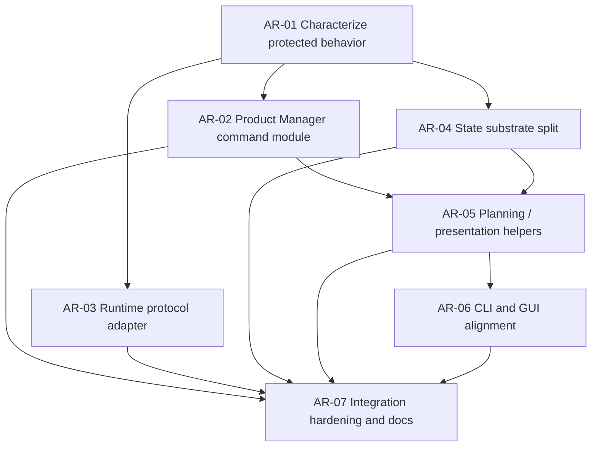

# Architecture Refactor Issue DAG

Source PRD: `docs/prd/architecture-refactor.md`

Source Canvas: `docs/architecture/CANVAS.md`

## Issue Table

| ID    | Title                                                | Mode | Dependencies                      | Parallel Safety                                                          | Review              |
| ----- | ---------------------------------------------------- | ---- | --------------------------------- | ------------------------------------------------------------------------ | ------------------- |
| AR-01 | Characterize protected behavior before refactor      | AFK  | none                              | Can run first only                                                       | manager-single-pass |
| AR-02 | Introduce Product Manager command module             | AFK  | AR-01                             | Serial with route/state work                                             | manager-strict-loop |
| AR-03 | Extract runtime protocol adapter                     | AFK  | AR-01                             | Serial with supervisor/runtime work                                      | manager-strict-loop |
| AR-04 | Split state substrate behind repository facade       | AFK  | AR-01                             | Serial with projection work                                              | manager-strict-loop |
| AR-05 | Introduce planning / presentation view helpers       | AFK  | AR-02, AR-04                      | Can parallelize with AR-03 after AR-02 starts only if files are disjoint | manager-single-pass |
| AR-06 | Align CLI and GUI with shared presentation contracts | AFK  | AR-05                             | Serial with presentation helper changes                                  | manager-single-pass |
| AR-07 | Integration hardening and documentation sync         | AFK  | AR-02, AR-03, AR-04, AR-05, AR-06 | Final integration only                                                   | manager-strict-loop |

## Mermaid DAG

## Execution Waves

### Wave 0: Characterization

- AR-01 runs first.
- Goal: make existing valuable behavior explicit in tests before moving code.
- Integration checkpoint: package-level tests for the characterization area
  pass before refactor slices begin.

### Wave 1: Deepen Core Server Seams

- AR-02, AR-03, and AR-04 can be assigned after AR-01, but should use disjoint
  file ownership.
- AR-02 owns product command orchestration.
- AR-03 owns runtime JSON-RPC/event adaptation.
- AR-04 owns repository/state-substrate internals.
- Integration checkpoint: each slice keeps current API behavior passing.

### Wave 2: Presentation

- AR-05 starts after Product Manager and state substrate shapes are stable.
- AR-06 follows AR-05 and aligns CLI/GUI consumers with the shared presentation
  contract.
- Integration checkpoint: CLI JSON snapshots/expectations and web tests pass.

### Wave 3: Hardening

- AR-07 runs last.
- Goal: root quality gate, dogfood smoke, documentation sync, and review-loop
  cleanup.

## Agent Briefs

## AR-01 Agent Brief

**Category:** refactor
**Summary:** Characterize regression-sensitive Codexhub behavior before
architecture refactor slices move code.

## Current Behavior

Codexhub already has working behavior for raw item storage, bounded reads,
session state transitions, follow-up sessions, runtime-supervisor fallback,
short session id resolution, run group dashboards, review metadata, worktree
sandboxing, workspace cleanup, fake Codex mode, CLI output, and GUI action
availability. Some behavior is tested already, but the refactor PRD identifies
these as protected surfaces that need clear coverage before module extraction.

## Desired Behavior

The test suite should make the protected behavior inventory in
`docs/prd/architecture-refactor.md` harder to regress. Existing tests may be
kept when sufficient; add or sharpen tests only where the behavior is weakly
covered.

## What To Build

Audit current tests against the PRD behavior inventory. Add focused
characterization tests for the highest-risk gaps, prioritizing:

- raw append and projection ordering,
- latest completed agent message stability,
- structured unavailable-runtime fallback,
- short session id ambiguity behavior before side effects,
- bounded transcript/dashboard reads,
- GUI/CLI action eligibility.

## Key Interfaces

- Core state-machine and transcript interfaces.
- Server API routes for sessions, messages, items, transcript, latest, follow-up,
  run groups, review findings, and workspace cleanup.
- Runtime controller fake/supervisor paths.
- CLI and GUI public behavior tests.

## Acceptance Criteria

- [ ] A short test coverage note is added to the worker handoff mapping PRD
      protected behaviors to existing or new tests.
- [ ] At least the highest-risk uncovered behaviors have focused tests.
- [ ] No public API, CLI, GUI, or schema behavior changes are introduced.
- [ ] New tests fail on plausible regressions, not only on implementation
      details.

## Required Tests

- Narrow package tests for every touched package.
- Root `pnpm test` if more than one package is touched.

## Required Evidence

- Changed files.
- Commands run and results.
- Coverage note listing protected behaviors and test locations.
- Documentation-impact check.

## Dependencies

- Blocked by: none.
- Blocks: AR-02, AR-03, AR-04.

## Classification

- Mode: AFK
- Risk: low
- Reversibility: reversible
- Testability: strong
- Review intensity: manager-single-pass
- Parallel safety: first slice only; do not parallelize before it lands.

## Out Of Scope

- Do not move production modules in this issue.
- Do not change public behavior to make tests easier.

## AR-02 Agent Brief

**Category:** refactor
**Summary:** Move worker product commands behind a Product Manager module while
preserving HTTP behavior.

## Current Behavior

Server routes directly parse HTTP requests, validate product rules, call
repository methods, call runtime methods, and construct responses. This makes
routes too knowledgeable about worker lifecycle and follow-up behavior.

## Desired Behavior

Server routes remain the HTTP adapter, while a Product Manager module owns
product commands and their side effects. Existing API routes and response shapes
remain compatible.

## What To Build

Introduce a server-side Product Manager module for a narrow first set of
commands:

- start worker,
- start follow-up worker,
- send steer or continue message,
- stop worker,
- complete worker.

Keep Fastify parsing and HTTP-specific error mapping outside Product Manager.
Product Manager should depend on runtime ownership and state substrate
interfaces, not Fastify request objects.

## Key Interfaces

- Product command input/output types for worker lifecycle commands.
- Runtime ownership interface currently represented by `CodexRuntimeController`.
- Repository/state facade used for product records and messages.
- Existing HTTP API response DTOs.

## Acceptance Criteria

- [ ] Existing session start, follow-up, send, stop, and complete routes return
      the same successful response shapes.
- [ ] Existing error behavior for terminal sessions, missing workspaces,
      missing live runtime, and prompt/message validation is preserved.
- [ ] Product Manager tests cover lifecycle command behavior without real Codex
      processes.
- [ ] Route handlers for the migrated commands are thinner and contain only HTTP
      parsing, command invocation, and HTTP response/error mapping.

## Required Tests

- Server tests for migrated routes.
- Product Manager unit tests with fake runtime and repository/database setup.
- Root `pnpm test` or `pnpm --filter @codexhub/server test` plus core build as
  required by current scripts.

## Required Evidence

- Commands run and results.
- Before/after summary of route responsibility changes.
- Confirmation that public API contracts were unchanged.
- Documentation-impact check.

## Dependencies

- Blocked by: AR-01.
- Blocks: AR-05, AR-07.

## Classification

- Mode: AFK
- Risk: medium-high
- Reversibility: reversible if done behind existing routes
- Testability: strong with fake runtime
- Review intensity: manager-strict-loop
- Parallel safety: serialize against other route/state refactors.

## Out Of Scope

- Do not migrate run group, review, workspace cleanup, or project/workspace
  creation commands unless needed for the lifecycle commands.
- Do not change runtime protocol handling.
- Do not change database schema.

## AR-03 Agent Brief

**Category:** refactor
**Summary:** Extract Codex App Server JSON-RPC and event translation from runtime
process ownership.

## Current Behavior

The runtime module owns child-process lifecycle, pending request bookkeeping,
JSON-RPC payload construction, stdout/stderr parsing, raw item append, and
native event interpretation.

## Desired Behavior

Runtime ownership continues to prove live process availability and manage
process handles. A Codex App Server adapter owns JSON-RPC request construction,
response extraction, event parsing, and normalized native event outcomes.

## What To Build

Extract adapter behavior behind an interface that can be tested without
spawning a child process. Preserve append-first raw event handling and existing
worker session state outcomes for turn completed, failed, cancelled, and input
required events.

## Key Interfaces

- Runtime Ownership Seam: process availability, start, send, stop, complete,
  shutdown.
- Codex App Server Adapter: native request payloads, response extraction, event
  normalization.
- Raw event append interface in the state substrate.
- Existing supervisor client/server routes.

## Acceptance Criteria

- [ ] Start, steer, continue, fake mode, stop, complete, and shutdown behavior
      remain compatible.
- [ ] Raw stdout/stderr JSON payloads are appended before normalized event
      effects are applied.
- [ ] Non-JSON process output remains stored as raw diagnostic items.
- [ ] Supervisor mode keeps the same structured unavailable and
      session-process-unavailable behavior.
- [ ] Adapter tests cover request payload construction and event normalization.

## Required Tests

- Runtime adapter unit tests.
- Server runtime/supervisor tests currently covering fake and supervisor paths.
- Relevant smoke or integration test if runtime behavior crosses process
  ownership.

## Required Evidence

- Commands run and results.
- Explanation of how append-first ordering is preserved.
- Confirmation that external supervisor behavior remains opt-in and fail-closed.
- Documentation-impact check, especially for `docs/runtime-supervisor.md`.

## Dependencies

- Blocked by: AR-01.
- Blocks: AR-07.

## Classification

- Mode: AFK
- Risk: high
- Reversibility: reversible but conflict-prone
- Testability: good if adapter is pure enough
- Review intensity: manager-strict-loop
- Parallel safety: serialize against other runtime/supervisor edits.

## Out Of Scope

- Do not add durable reattach after supervisor restart.
- Do not change Codex App Server protocol semantics.
- Do not change runtime supervisor ports, config names, or documented fallback
  behavior unless a test proves the docs are stale.

## AR-04 Agent Brief

**Category:** refactor
**Summary:** Split Codexhub state substrate responsibilities behind the existing
repository facade.

## Current Behavior

The repository module contains product-record writes, raw item writes,
transcript projection queries, latest item queries, run group dashboard
summaries, review metadata, row mapping, id generation, and session resolution.

## Desired Behavior

The public repository facade can remain for compatibility, but internally the
state substrate separates product records, raw Codex event log, and projection
queries. Existing schema and external behavior remain unchanged.

## What To Build

Refactor repository internals into focused modules or classes with clear test
surfaces:

- product records,
- raw item/event log,
- projection/read models,
- row mapping/helpers where useful.

Keep public callers stable during the first pass.

## Key Interfaces

- Existing repository facade methods.
- Raw event append and item listing.
- Transcript and latest-agent-message projection.
- Run group dashboard summary projection.
- Review gate and review finding records.
- Session resolution.

## Acceptance Criteria

- [ ] Existing repository facade methods used by server/runtime still work.
- [ ] No SQLite schema migration is introduced solely for refactor.
- [ ] Raw item losslessness, monotonic sequencing, latest completed agent
      message, transcript windows, dashboard summaries, and session resolution
      behavior are covered by tests.
- [ ] The resulting modules improve locality: projection logic is no longer
      interleaved with unrelated product-record writes.

## Required Tests

- Server repository tests or focused tests added for the split modules.
- Root `pnpm test` if repository changes affect API behavior.

## Required Evidence

- Commands run and results.
- Short map of old repository responsibilities to new modules.
- Confirmation that schema and public response contracts are unchanged.
- Documentation-impact check.

## Dependencies

- Blocked by: AR-01.
- Blocks: AR-05, AR-07.

## Classification

- Mode: AFK
- Risk: medium-high
- Reversibility: reversible but broad
- Testability: strong with SQLite temp databases
- Review intensity: manager-strict-loop
- Parallel safety: serialize against route and projection work touching the same
  files.

## Out Of Scope

- Do not rename database tables.
- Do not introduce a new ORM.
- Do not change pagination defaults or cursor semantics.

## AR-05 Agent Brief

**Category:** refactor
**Summary:** Introduce planning / presentation helpers for bounded operator
views.

## Current Behavior

Presentation decisions are split across server route helpers, CLI formatters,
GUI helpers, and web components. Some action availability and bounded-view
rules are duplicated or close to product rules.

## Desired Behavior

Operator-facing views have a clearer planning / presentation interface that
converts records and projections into bounded view models and next-action
affordances. The first pass may live server-side, with pure shared helpers moved
to core only when useful to CLI and GUI.

## What To Build

Create presentation helpers for a narrow first set of views:

- session detail,
- latest result,
- transcript window metadata,
- run group dashboard summary,
- session action availability.

Use existing API response shapes unless a later issue explicitly migrates them.

## Key Interfaces

- Core DTOs and state-machine helpers.
- State substrate projection reads.
- Server response helpers.
- Web action availability helper and transcript view helper.
- CLI result/trace/session formatting expectations.

## Acceptance Criteria

- [ ] Bounded reads remain bounded by default.
- [ ] Session action availability follows the shared state-machine rules and
      existing GUI behavior.
- [ ] Latest result and transcript window behavior stay compatible.
- [ ] Run group dashboard attention reasons and review counts stay compatible.
- [ ] Helpers are tested through public view-model behavior, not private line
      placement.

## Required Tests

- Presentation helper tests.
- Existing web helper tests.
- Existing CLI/server tests for affected output.

## Required Evidence

- Commands run and results.
- Summary of presentation rules centralized in the new helpers.
- Confirmation that API/CLI/GUI user-visible behavior is unchanged.
- Documentation-impact check.

## Dependencies

- Blocked by: AR-02, AR-04.
- Blocks: AR-06, AR-07.

## Classification

- Mode: AFK
- Risk: medium
- Reversibility: reversible
- Testability: strong
- Review intensity: manager-single-pass
- Parallel safety: can parallelize with runtime work, but not with CLI/GUI
  consumers of the same helpers.

## Out Of Scope

- Do not redesign the GUI.
- Do not change CLI human output unless required to preserve behavior after
  helper extraction.
- Do not make raw/debug views the default operator view.

## AR-06 Agent Brief

**Category:** refactor
**Summary:** Align CLI and GUI consumers with shared presentation contracts.

## Current Behavior

CLI and GUI already consume bounded API surfaces, but some formatting,
availability, and transcript rules remain local to each app.

## Desired Behavior

CLI and GUI should rely on shared server/API presentation contracts where
available and keep only app-specific rendering locally. CLI JSON stability and
GUI readability remain unchanged.

## What To Build

Update CLI and GUI consumers to use the presentation outputs/helpers introduced
by AR-05 where appropriate. Keep app-local code for actual terminal text and
React rendering, but remove duplicated product-state decisions when the shared
contract now owns them.

## Key Interfaces

- Shared API DTOs.
- CLI `--json` responses and human command output.
- Web session actions, transcript view, run group dashboard, and session detail.
- Presentation helper outputs from AR-05.

## Acceptance Criteria

- [ ] CLI JSON outputs for affected commands remain stable.
- [ ] GUI controls remain disabled/available for the same session states as
      before.
- [ ] Transcript and raw item views remain readable and bounded.
- [ ] App-local rendering code does not duplicate product eligibility rules
      already owned by shared helpers.

## Required Tests

- CLI program tests for affected commands.
- Web helper/component tests for affected views.
- Browser verification if meaningful UI layout changes are made.

## Required Evidence

- Commands run and results.
- Screenshots or browser verification only if visual layout changes occur.
- Confirmation that CLI JSON stayed stable.
- Documentation-impact check.

## Dependencies

- Blocked by: AR-05.
- Blocks: AR-07.

## Classification

- Mode: AFK
- Risk: medium
- Reversibility: reversible
- Testability: good
- Review intensity: manager-single-pass
- Parallel safety: serialize against AR-05 helper interface changes.

## Out Of Scope

- Do not add new GUI workflows.
- Do not change command names or introduce new CLI flags unless required by an
  explicit follow-up.

## AR-07 Agent Brief

**Category:** refactor
**Summary:** Run integration hardening, documentation sync, and review cleanup
for the architecture refactor.

## Current Behavior

The refactor will land across several slices. Each slice should run local gates,
but the full architecture change needs one final pass to catch cross-package
regressions and update docs.

## Desired Behavior

The branch is ready for human review with root gates passing or documented,
docs synchronized, and review risks addressed.

## What To Build

Run the final integration pass:

- root quality gate or justified narrow gates,
- fake dogfood smoke if runtime/API behavior changed,
- docs synchronization across Canvas, PRD, DAG, roadmap, runtime supervisor, and
  issue backlog as needed,
- review-loop packet for Standards and Spec review.

## Key Interfaces

- Root package scripts.
- Fake dogfood smoke command.
- Architecture Canvas, PRD, DAG, runtime supervisor docs, roadmap, and GitHub
  issue drafts.
- Review gate artifacts.

## Acceptance Criteria

- [ ] Root `pnpm quality` passes, or every skipped/failing gate has a concrete
      documented reason.
- [ ] Fake dogfood smoke is run if runtime/API orchestration changed, or skipped
      with a documented reason.
- [ ] Docs reflect any public behavior, workflow, or architecture-source changes.
- [ ] A review packet is prepared with changed files, validation, risks, and
      links to Canvas/PRD/DAG.
- [ ] No known unresolved refactor regression remains without a follow-up issue.

## Required Tests

- `pnpm quality` by default.
- Package-level gates only if the manager accepts a narrower final pass.
- Fake dogfood smoke when runtime/API behavior changed.

## Required Evidence

- Commands run and results.
- Documentation-impact check with specific files updated or "no docs needed"
  rationale.
- Review findings and worker responses.
- Follow-up issues or open risks.

## Dependencies

- Blocked by: AR-02, AR-03, AR-04, AR-05, AR-06.
- Blocks: none.

## Classification

- Mode: AFK
- Risk: medium-high
- Reversibility: final integration only
- Testability: strong
- Review intensity: manager-strict-loop
- Parallel safety: final serial checkpoint.

## Out Of Scope

- Do not add new refactor scope during hardening except to fix regressions from
  earlier AR slices.

## Open Questions

- Human alignment may be useful before AR-05 if the team wants Planning /
  Presentation helpers in `packages/core` immediately instead of server-side
  first.
- Human alignment may be useful before AR-03 if the Codex App Server protocol
  adapter interface would make future upstream protocol replacement a goal.

## Readiness For AFK Implementation

The DAG is ready for `afk-implementation-manager` once AR-01 is accepted as the
first execution slice. The remaining open questions are not blockers; they can
be resolved at the AR-05 and AR-03 assignment boundaries if needed.
