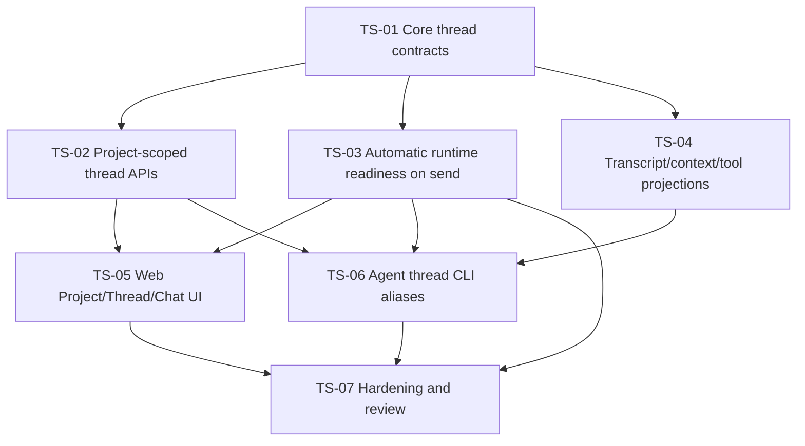

# Thread State And Chat UI Refactor DAG

Source PRD: `docs/prd/thread-state-ui-refactor.md`

Prototype references:

- `docs/prototypes/codexhub-thread-state-architecture.md`
- `docs/prototypes/codexhub-session-architecture-prototype.html`

Implementation evidence:

- `docs/implementation/thread-state-ui-refactor-evidence.md`
- `docs/implementation/thread-state-ui-refactor-review.md`

Status: implemented and validated locally on 2026-05-22. Clean-context final
review pass requested after fixes.

## Issue Table

| ID    | Title                                                | Mode | Depends On          | Parallel |
| ----- | ---------------------------------------------------- | ---- | ------------------- | -------- |
| TS-01 | Add thread-oriented core contracts and projections   | AFK  | none                | Yes      |
| TS-02 | Add project-scoped thread creation/read APIs         | AFK  | TS-01               | No       |
| TS-03 | Make send ensure runtime readiness automatically     | AFK  | TS-01               | Yes      |
| TS-04 | Add transcript, context-window, and tool projections | AFK  | TS-01               | Yes      |
| TS-05 | Refactor web navigation and chat surface             | AFK  | TS-02, TS-03        | No       |
| TS-06 | Design and add agent-oriented thread CLI aliases     | AFK  | TS-02, TS-03, TS-04 | Yes      |
| TS-07 | Integration hardening and review packet              | AFK  | TS-03, TS-05, TS-06 | No       |

## Mermaid DAG

## Issue Briefs

### TS-01: Add Thread-Oriented Core Contracts And Projections

## Agent Brief

**Category:** enhancement
**Summary:** Introduce shared thread/conversation/runtime DTOs without removing
existing session types.

## Current Behavior

Core exposes `WorkerSessionStatus` with runtime/process and product lifecycle
mixed together. UI and API code tend to consume session status directly.

## Desired Behavior

Shared contracts distinguish thread lifecycle, conversation flow, and runtime
attachment while preserving existing session DTOs for compatibility.

## What To Build

- Add thread-oriented types in `packages/core`.
- Add projection helpers that derive thread summaries from existing
  `WorkerSession`, message, and item data.
- Do not delete or rename existing `WorkerSession` contracts in this issue.

## Key Interfaces

- `packages/core/src/types.ts`
- `packages/core/src/session-presentation.ts`
- `packages/core/src/transcript.ts`

## Acceptance Criteria

- [ ] Core exports `ThreadState`, `ConversationState`, and `RuntimeState`.
- [ ] Projection helper maps existing sessions into thread-facing summaries.
- [ ] `failed` runtime/session conditions do not become thread lifecycle
      `failed`.
- [ ] Existing tests for session presentation still pass.

## Required Tests

- Core unit tests for state derivation.
- Regression tests for existing session presentation behavior.

## Required Evidence

- `pnpm --filter @codexhub/core check`
- `pnpm --filter @codexhub/core test`

## Dependencies

- Blocked by: none
- Blocks: TS-02, TS-03, TS-04

## Classification

- Mode: AFK
- Risk: medium, because shared DTOs affect server/web/cli consumers
- Reversibility: high
- Testability: clear unit-test seam
- Review intensity: manager-single-pass
- Parallel safety: safe with API/UI issues only after interface names settle

## Out Of Scope

- Database migrations.
- UI changes.
- Removing existing session APIs.

### TS-02: Add Project-Scoped Thread Creation/Read APIs

## Agent Brief

**Category:** enhancement
**Summary:** Add API paths or DTO aliases that make project-owned thread
creation explicit.

## Current Behavior

Sessions can be created, but the product language and UI flow do not clearly
express project-scoped Thread creation.

## Desired Behavior

API supports creating an empty thread under a project and reading thread
summaries using thread-oriented DTOs. Existing session endpoints remain
compatible.

## What To Build

- Add server routes or compatibility aliases for project-scoped thread creation.
- Support creating an empty thread without requiring an initial message.
- Return thread-oriented DTOs backed by existing session/workspace records.
- Keep existing `/sessions` behavior intact.

## Key Interfaces

- `apps/server/src/server.ts`
- `apps/server/src/product-manager.ts`
- `apps/server/src/repository.ts`
- `packages/core/src/api.ts`

## Acceptance Criteria

- [ ] A project-scoped create request creates/selects an empty thread.
- [ ] Empty thread has project/workspace/cwd ownership.
- [ ] Existing session creation tests remain compatible.
- [ ] Thread read DTO does not expose runtime liveness as user-facing failure.

## Required Tests

- Server integration tests for empty thread creation.
- API contract tests for thread summary shape.
- Existing session creation tests.

## Required Evidence

- `pnpm --filter @codexhub/server check`
- `pnpm --filter @codexhub/server test`
- `pnpm --filter @codexhub/core test`

## Dependencies

- Blocked by: TS-01
- Blocks: TS-05, TS-06

## Classification

- Mode: AFK
- Risk: medium
- Reversibility: high if added as aliases/read models
- Testability: clear server route tests
- Review intensity: manager-single-pass
- Parallel safety: avoid parallel edits to same server route file

## Out Of Scope

- Removing `/sessions`.
- Implementing board/run-group UI.

### TS-03: Make Send Ensure Runtime Readiness Automatically

## Agent Brief

**Category:** enhancement
**Summary:** Make message send own runtime start/reconnect/resume behavior.

## Current Behavior

Unavailable runtime can surface as process failure and follow-up semantics rather
than seamless continuation.

## Desired Behavior

Sending a message to a readable thread attempts to ensure runtime readiness
before turn delivery. Only unrecoverable readiness or send failures are shown as
send errors.

## What To Build

- Add `ensureRuntimeReady(thread/session)` behavior at the server/runtime seam.
- Use existing Codex resume cursor/thread identifiers where available.
- Keep runtime failure details internal unless needed for retry/error display.
- Preserve raw item ingestion and message sent/failed marking.
- Add per-thread transaction or compare-and-set guard so duplicate concurrent
  sends cannot start overlapping turns unintentionally.
- Add or specify idempotency behavior for retried send requests.

## Key Interfaces

- `apps/server/src/product-manager.ts`
- `apps/server/src/runtime-supervisor.ts`
- `apps/server/src/runtime.ts`
- `apps/server/src/codex-app-server-adapter.ts`

## Acceptance Criteria

- [ ] Sending to not-started runtime starts and delivers the message.
- [ ] Sending to detached/unavailable runtime attempts reconnect/resume before
      failing.
- [ ] Runtime unavailability does not mark the thread lifecycle failed.
- [ ] Failed readiness marks the message/send path as failed with retryable
      context.
- [ ] Duplicate retries with the same idempotency key do not create duplicate
      messages or turns.
- [ ] Concurrent continue/send attempts are serialized or rejected with a
      machine-readable error.

## Required Tests

- Runtime seam tests using fake runtime/supervisor.
- Product manager tests for send to unavailable runtime.
- Regression tests for sent/failed message persistence.
- Concurrency/idempotency tests for duplicate or overlapping send attempts.

## Required Evidence

- `pnpm --filter @codexhub/server check`
- `pnpm --filter @codexhub/server test`

## Dependencies

- Blocked by: TS-01
- Blocks: TS-05, TS-07

## Classification

- Mode: AFK
- Risk: high, because runtime ownership and process lifecycle are sensitive
- Reversibility: medium
- Testability: clear seam if fake runtime is used
- Review intensity: manager-strict-loop
- Parallel safety: do not parallelize with unrelated runtime refactors

## Out Of Scope

- New Codex protocol features beyond existing start/resume/send capabilities.
- Human-visible Resume button.

### TS-04: Add Transcript, Context-Window, And Tool Projections

## Agent Brief

**Category:** enhancement
**Summary:** Clarify and test transcript windows, compact agent context windows,
and expandable tool-call projections as query-derived read models.

## Current Behavior

Transcript reads already support `limit`, `recent`, `after`, `before`, and
cursor-like parameters, but the product model needs to make clear that message
window is not durable state. Tool calls are currently item classifications rather
than a first-class collapsed/expanded read model.

## Desired Behavior

Transcript APIs expose bounded windows suitable for virtualized lists without
persisting a per-thread visible window. Agent APIs can also request one compact
context packet with thread summary, latest message, recent transcript, allowed
actions, attention reasons, and cursors.

## What To Build

- Keep or refine transcript read contracts around stable sequence windows.
- Ensure recent windows and older-page reads work with grouped agent messages.
- Document/API-test that window parameters are read parameters only.
- Add or specify compact context-window read shape for manager agents.
- Add or specify collapsed tool-call projection and explicit raw item expansion.

## Key Interfaces

- `packages/core/src/transcript.ts`
- `apps/server/src/repository.ts`
- `apps/server/src/server.ts`
- `apps/cli/src/program.ts`

## Acceptance Criteria

- [ ] Recent transcript reads return stable ordered entries.
- [ ] `before`/`after` windows work for older-history loading.
- [ ] Agent message grouping remains intact.
- [ ] No durable message-window table/state is introduced.
- [ ] Context-window read returns bounded transcript, latest message, allowed
      actions, attention reasons, and cursors.
- [ ] Tool calls can be read as collapsed rows and expanded to item/raw details.

## Required Tests

- Core transcript projection tests.
- Server transcript pagination tests.
- Server tests for context-window shape and tool-call projection.
- CLI trace/read tests if output shape changes.

## Required Evidence

- `pnpm --filter @codexhub/core test`
- `pnpm --filter @codexhub/server test`
- `pnpm --filter @codexhub/cli test` if CLI touched

## Dependencies

- Blocked by: TS-01
- Blocks: TS-06

## Classification

- Mode: AFK
- Risk: low to medium
- Reversibility: high
- Testability: clear unit/integration tests
- Review intensity: manager-single-pass
- Parallel safety: safe if server route edits do not overlap with TS-02

## Out Of Scope

- Frontend virtual-list library integration unless required by TS-05.

### TS-05: Refactor Web Navigation And Chat Surface

## Agent Brief

**Category:** enhancement
**Summary:** Make the web UI match the project-scoped Thread/Chat prototype.

## Current Behavior

The UI exposes session/runtime-oriented concepts and global creation behavior
that does not make project ownership clear.

## Desired Behavior

The primary UI is a quiet Project -> Thread -> Chat surface. Each project owns
its new-thread button. Empty threads show a focused composer. Runtime/resume
details are not persistent header UI.

## What To Build

- Implement project sidebar with per-project new thread control.
- Select empty thread immediately after creation.
- Keep composer visible for selected readable thread.
- On send, show transient sending/streaming states only as needed.
- Remove persistent runtime/window/ready badges from the chat header.
- Prepare transcript rendering for virtualized/windowed reads.

## Key Interfaces

- `apps/web/src`
- Shared core/API DTOs from TS-01/TS-02

## Acceptance Criteria

- [ ] New Thread button is scoped to each project.
- [ ] Empty thread opens to blank transcript and focused composer.
- [ ] Sending first message creates normal chat flow.
- [ ] No primary Resume button is shown.
- [ ] No persistent runtime/window badges are shown.
- [ ] Existing web tests pass or are updated to new semantics.

## Required Tests

- Web component/state tests for project-scoped thread creation.
- Web tests for empty-thread composer and send flow.
- Browser verification screenshot for desktop and narrow viewport.

## Required Evidence

- `pnpm --filter @codexhub/web check`
- `pnpm --filter @codexhub/web test`
- `pnpm --filter @codexhub/web build`
- Browser verification notes/screenshots

## Dependencies

- Blocked by: TS-02, TS-03
- Blocks: TS-07

## Classification

- Mode: AFK
- Risk: medium
- Reversibility: high
- Testability: clear web tests plus browser verification
- Review intensity: manager-single-pass
- Parallel safety: not parallel with other broad web refactors

## Out Of Scope

- Board/dashboard views.
- Run group UI.
- Marketing or landing-page UI.

### TS-06: Design And Add Agent-Oriented Thread CLI Aliases

## Agent Brief

**Category:** enhancement
**Summary:** Add thread-oriented CLI commands for manager agents while
preserving existing session commands/contracts.

## Current Behavior

CLI and API are session-first. Manager-facing reads are bounded and structured,
but terminology is not aligned with the new product model. Automated agents also
lack a clearly designed thread command surface for idempotent writes and
waitable sends.

## Desired Behavior

CLI/API can expose thread-oriented aliases or summaries without breaking
existing session-based automation. Agent calls can create, inspect, send to, and
read context from threads using stable JSON.

## What To Build

- Add thread-oriented aliases for create/list/inspect/send/trace/latest.
- Keep JSON output backward-compatible for existing session commands.
- Add or specify idempotency flags for create/send writes.
- Add or specify send wait modes for accepted, first event, and turn complete.
- Update help text/docs to explain Thread as product object and session/runtime
  as implementation layer.

## Key Interfaces

- `apps/cli/src/program.ts`
- `packages/core/src/api.ts`
- `docs/prototypes/codexhub-agent-cli-design.md`
- `README.md` or docs destination identified by documentation system

## Acceptance Criteria

- [ ] Existing CLI session commands keep stable JSON.
- [ ] Thread aliases exist for the primary agent path: create, list, inspect,
      send, trace, latest.
- [ ] New or updated help text avoids making runtime resume a primary concept.
- [ ] Manager-facing transcript/window reads remain bounded.
- [ ] Create/send idempotency is implemented or recorded as a blocking follow-up
      before unattended retry loops rely on it.
- [ ] Send wait-mode behavior is implemented or recorded as a blocking follow-up
      before unattended manager loops rely on it.
- [ ] Documentation impact check is recorded.

## Required Tests

- CLI program tests for compatibility.
- CLI tests for any new aliases/help text.
- CLI tests for idempotency flags and wait-mode parsing/behavior when
  implemented.

## Required Evidence

- `pnpm --filter @codexhub/cli check`
- `pnpm --filter @codexhub/cli test`
- Documentation-impact note

## Dependencies

- Blocked by: TS-02, TS-03, TS-04
- Blocks: TS-07

## Classification

- Mode: AFK
- Risk: medium due to automation compatibility
- Reversibility: high
- Testability: clear CLI output tests
- Review intensity: manager-single-pass
- Parallel safety: safe if CLI-only

## Out Of Scope

- Removing old session command names.
- Making run groups part of the primary agent CLI.

### TS-07: Integration Hardening And Review Packet

## Agent Brief

**Category:** enhancement
**Summary:** Validate the refactor end-to-end and prepare review evidence.

## Current Behavior

Individual slices can pass while cross-package behavior still drifts.

## Desired Behavior

The combined branch proves the new Thread/Chat model works across core, server,
CLI, and web with documented evidence and review findings addressed.

## What To Build

- Run integration checks across touched packages.
- Update docs/evidence for implemented behavior.
- Run clean-context review loop on Spec Review and Standards Review axes.
- Create follow-up issues only for real residual risks.

## Key Interfaces

- Root package scripts
- `docs/implementation/thread-state-ui-refactor-evidence.md`
- `docs/implementation/thread-state-ui-refactor-review.md`

## Acceptance Criteria

- [ ] Root quality gate passes or skipped gates are justified.
- [ ] Evidence file records commands and browser verification.
- [ ] Clean-context review loop has no blocking findings.
- [ ] Documentation-impact check is complete.

## Required Tests

- Narrow package gates as needed.
- Root `pnpm quality` unless explicitly scoped out by manager.

## Required Evidence

- `pnpm quality`
- Browser verification for web UI
- Review report path and findings status

## Dependencies

- Blocked by: TS-03, TS-05, TS-06
- Blocks: final handoff

## Classification

- Mode: AFK
- Risk: medium
- Reversibility: high
- Testability: full quality gate
- Review intensity: manager-strict-loop
- Parallel safety: single integrator only

## Out Of Scope

- Adding new product scope after review begins.

## Execution Waves

### Wave 1: Contracts And Read Model Groundwork

- TS-01
- TS-04 can start after TS-01 interface names are clear.

### Wave 2: API And Runtime Behavior

- TS-02
- TS-03

These can run with separate ownership. TS-03 should not overlap with unrelated
runtime lifecycle refactors.

### Wave 3: Human/Agent Surfaces

- TS-05
- TS-06

Run after API semantics are stable enough for web/CLI consumers.

### Wave 4: Integration And Review

- TS-07

Single integrator owns cross-package fixes, evidence, and review loop.

## Open Questions

- None blocking.

Execution assumptions:

- Keep existing session endpoints and JSON compatibility during the first
  implementation pass.
- Add thread-oriented aliases/read models before any database rename.
- Keep deletion out of ThreadState.
- Keep board/run-group UI out of scope.
- Treat transcript windows as request/query/read-model state.
- Treat the human-approved decisions in
  `docs/prd/thread-state-ui-refactor.md` as the implementation baseline.

## Readiness

Ready for `afk-implementation-manager` with manager oversight on TS-03 and TS-07.

Do not publish GitHub issues from this draft unless the human explicitly asks.
