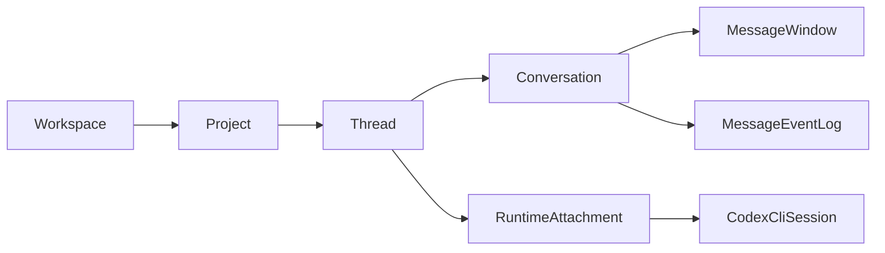
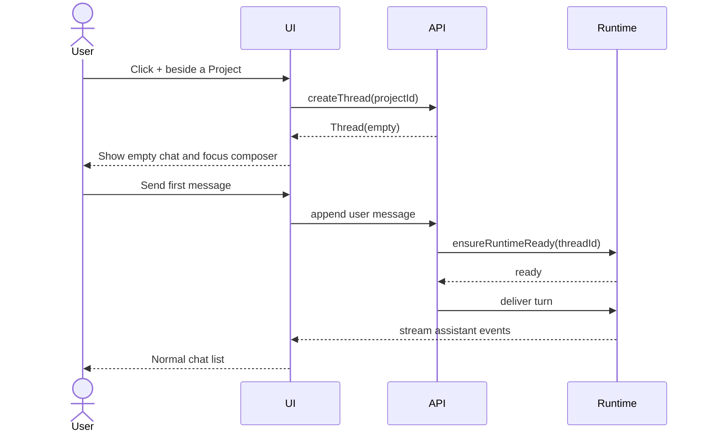
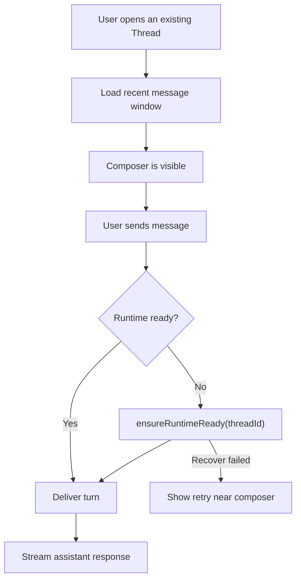

# Codexhub Thread State Architecture Prototype

This prototype separates the user-facing product objects from runtime process
bookkeeping. The UI should let people continue work inside a project thread; it
should not ask them to manage Codex process attachment directly.

## Object Model



- Project is the ownership boundary for cwd, settings, and thread creation.
- Thread is the user-facing task/conversation object.
- Conversation is the message/event stream shown as chat.
- Runtime attachment is an implementation detail used to deliver the next turn.

## State Layers

```ts
type ThreadState = "empty" | "active" | "archived";

type ConversationState =
  | "loadingHistory"
  | "ready"
  | "sendingUserMessage"
  | "streamingAssistant"
  | "failedToSend"
  | "failedToLoad";

type RuntimeState =
  | "unknown"
  | "notStarted"
  | "starting"
  | "ready"
  | "busy"
  | "paused"
  | "exited"
  | "failed";
```

`RuntimeState !== "ready"` is not a failed thread. It only means Codexhub must
run `ensureRuntimeReady(threadId)` before delivering the next user message.

Deletion is not a normal `ThreadState`. If the product supports deleting a
thread, model it as either a hard delete or a repository tombstone such as
`deletedAt`, then exclude it from default reads. This avoids treating "deleted"
as a resumable lifecycle state.

## Relationship To Codex And T3 Code

Codex exposes previous work as resumable sessions through the CLI. T3 Code
builds a higher-level project/thread interface on top of provider sessions and
stores resume cursors so a thread can reconnect to an underlying Codex session.

Codexhub should follow the same separation of concerns, but with product terms:

- Thread is the durable user-facing object.
- Conversation is the projected message stream.
- Runtime/session is the provider attachment needed to deliver a turn.
- Resume/reconnect is an internal send-path behavior unless it fails.

## New Thread Flow



## Continue Thread Flow



## UI Consequences

- New Thread controls belong beside each project, not in a global ambiguous
  toolbar.
- An empty thread is a real selected thread with an empty transcript and focused
  composer.
- The composer is always visible for readable, resumable threads.
- Runtime, transcript-windowing, and ready/idle facts should not be persistent
  header badges. The default chat surface should be quiet; show status only
  when the user is waiting, blocked, or needs to retry.
- Resume is not a primary button. Sending a message is the user intent;
  reconnecting or resuming is Codexhub's responsibility.
- Long transcripts should be read through a windowed/virtualized message list
  with stable message IDs, cursor pagination, and a jump-to-latest affordance
  when the user is reading history.
